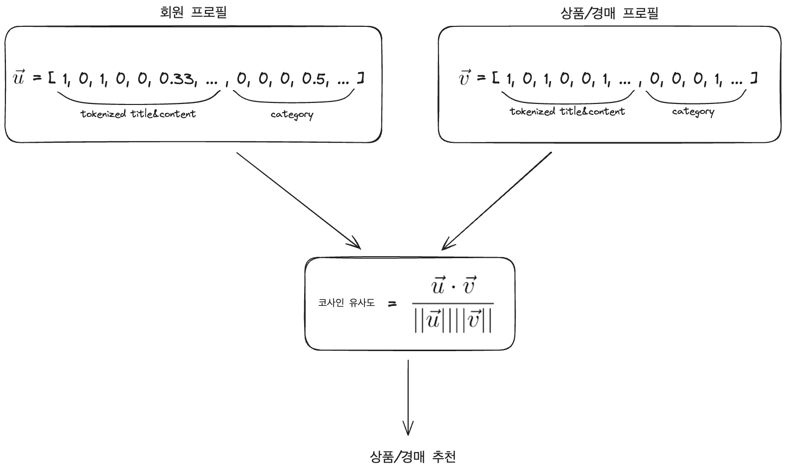

# 🌱 중고 상품 플랫폼 Fresh Trash의 추천 시스템

## API Documentation

- [FreshTrash-RecSys API Documentation](https://documenter.getpostman.com/view/11961003/2sA3s3JXc3)

## Content-based 추천 알고리즘

- 회원 프로필과 상품/경매 프로필은 하나의 벡터로 표현됩니다.
   - **상품/경매의 제목, 본문을 tokenize**하고 one-hot encoding한 값과 **카테고리**를 one-hot encoding 한 값을 이용합니다.
   - 추천 알고리즘이 동작하면 **회원 프로필과 각 상품/경매 프로필에 대한 코사인 유사도를 계산**하고 상위에 지정한 개수만큼 선택하여 반환합니다.

   

## Tech Stacks

### Backend

    
    
    
    

- **FastAPI**, **Uvicorn** 로 서버를 구축했습니다.
- **SQLAlchemy** 로 객체 지향 데이터 로직을 작성했습니다.
- Huggingface의 **Transformers** 를 통해 pre-trained tokenizer를 추천 시스템 구현에 활용했습니다.

### Database

   

- **MariaDB** 를 데이터베이스로 사용합니다.

### DevOps

   

- **Docker** 로 일관성있는 개발 환경을 구축합니다.
